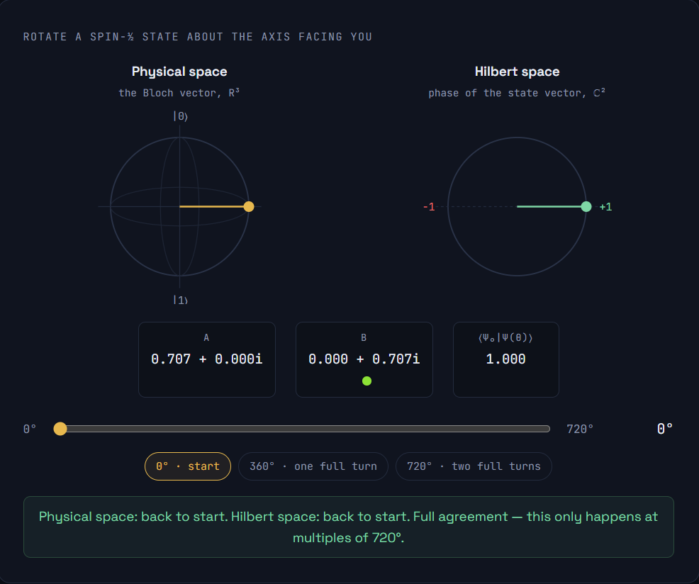
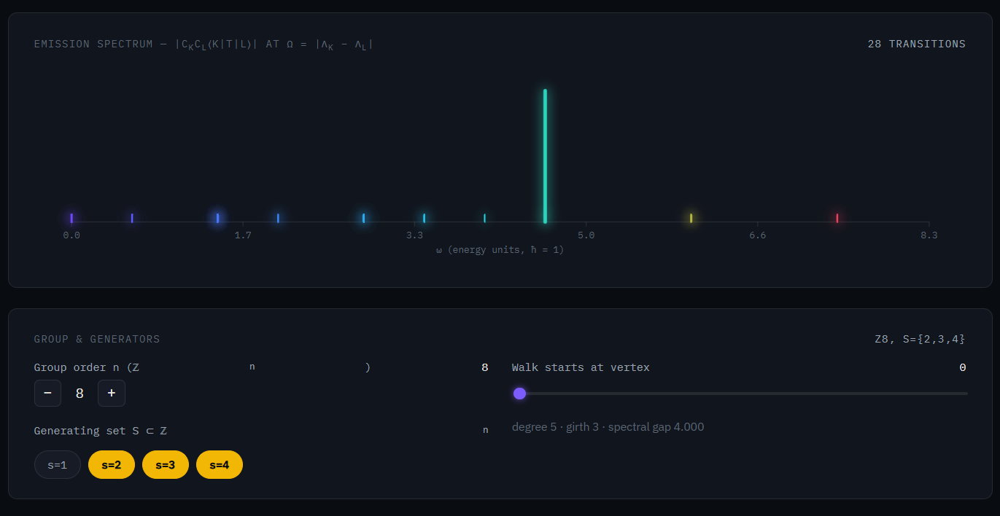
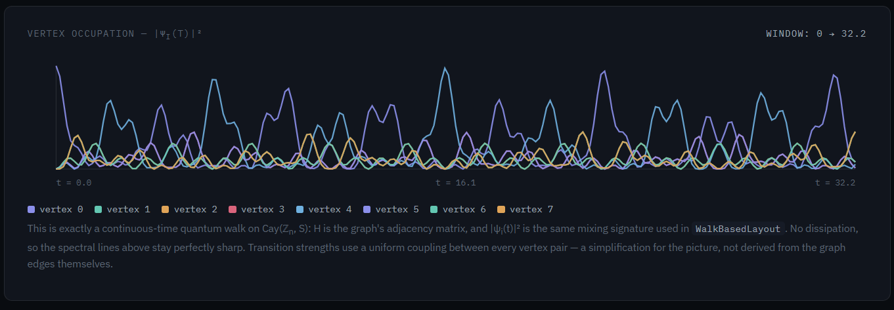

# Qiskit StateViz

[](https://opensource.org/licenses/MIT)
[](https://qisk.it/e)

## Screenshots


Interactive, Plotly-based statevector visualizations for Qiskit — a drop-in,
rotate/zoom/hover companion to the static matplotlib views in
`qiskit.visualization`.

Qiskit's built-in `plot_state_qsphere` and `plot_bloch_multivector` return
static `matplotlib.figure.Figure` objects. That's often exactly what you
want for a paper figure, but it makes it hard to tell where a Bloch vector
actually points, or to explore a Q-sphere's phase structure interactively
in a notebook. `qiskit-stateviz` provides interactive equivalents that take
the same `Statevector` / `DensityMatrix` objects you already have.

## Why this exists

There's real prior art here worth naming:

- **[Kaleidoscope](https://github.com/QuSTaR/kaleidoscope)** (Paul Nation,
  IBM Quantum) has interactive Plotly `qsphere()` and `bloch_sphere()`
  functions, and the core rendering still works. But its Qiskit integration
  layer hard-requires `qiskit-terra` and `qiskit-ibmq-provider` — both
  merged/deprecated since Qiskit 1.0 — so it fails immediately on any
  current install.
- **[plotly-qsphere](https://github.com/crystaldot/plotly-qsphere)** is a
  small, focused interactive Q-sphere built on Plotly, but doesn't cover
  Bloch spheres, density matrices, or mixed states.
- **[Quantum-Glasses](https://github.com/qiskit-community/quantum-glasses)**
  is a Qiskit Ecosystem member, but it's a Tkinter desktop GUI limited to
  single-qubit states, not a notebook-native Plotly tool.

`qiskit-stateviz` is built fresh against current Qiskit (`>=2.0`, tested
against 2.5.x), takes `Statevector`/`DensityMatrix` objects directly with
no legacy dependencies, and covers both Q-sphere and per-qubit Bloch views.

## Install

```bash
pip install qiskit-stateviz
```

or from source:

```bash
git clone https://github.com/RexRowan/qiskit-stateviz.git
cd qiskit-stateviz
pip install -e .
```

If you also want to draw circuits with `qc.draw('mpl')` (used in the demo
notebook, not required by the package itself), install `pylatexenc` too:

```bash
pip install pylatexenc
```

`plot_evolution_spectrum` (see below) depends on the separate
[`qiskit-eigenlight`](https://github.com/RexRowan/qiskit-eigenlight)
package for its diagonalization/spectrum math. It's an optional extra, not
a core dependency:

```bash
pip install qiskit-stateviz[spectrum]
```

Everything else in this package works fine without it.

## Usage

```python
from qiskit import QuantumCircuit
from qiskit.quantum_info import Statevector
from qiskit_stateviz import plot_qsphere_interactive, plot_bloch_multivector_interactive

qc = QuantumCircuit(3)
qc.h(0)
qc.cx(0, 1)
qc.cx(1, 2)  # GHZ state

sv = Statevector(qc)

# Interactive Q-sphere: rotate, zoom, hover for amplitude/phase/probability
fig = plot_qsphere_interactive(sv, title="GHZ state")
fig.show()

# One interactive Bloch sphere per qubit
fig2 = plot_bloch_multivector_interactive(sv)
fig2.show()
```

Both functions also accept a `DensityMatrix` (for `plot_bloch_multivector_interactive`)
or a plain `numpy.ndarray` of amplitudes, matching the calling convention of
`qiskit.visualization`.

### Spin rotation: the Bloch sphere vs. the actual SU(2) state



```python
from qiskit_stateviz import plot_spin_rotation_interactive

# Defaults to the |+i> state; animates 0-720 degrees with Play/Pause + slider
fig3 = plot_spin_rotation_interactive()
fig3.show()

# Or drive it with your own single-qubit state and rotation axis
fig4 = plot_spin_rotation_interactive(Statevector.from_label("+"), axis="z")
fig4.show()
```
Or visit [this website](https://spinor.netlify.app/)

`R(theta) = exp(-i theta (n.sigma) / 2)` satisfies `R(2*pi) = -I` for *any*
axis and *any* initial single-qubit state — a full physical turn always
multiplies the state by an invisible global phase of -1, and only a second
full turn (720 degrees / 4*pi) brings it back to +I. `plot_spin_rotation_interactive`
animates this directly: a Bloch-sphere panel (period 360 degrees, since it
can't see global phase) next to a dial tracking the SU(2) rotation parameter
theta/2 (period 720 degrees), so the two panels visibly fall out of sync at
360 degrees and resync at 720. If no axis is given, one orthogonal to the
input state's Bloch vector is picked automatically, which keeps the dial's
`<psi0|psi(theta)>` overlap readout a clean real-valued oscillation between
-1 and +1.

### A note on Bloch multivector and entanglement

Like Qiskit's own `plot_bloch_multivector`, the per-qubit Bloch view only
shows single-qubit marginals (reduced density matrices). A maximally
entangled qubit's Bloch vector has zero length even though the full joint
state is pure — this view *cannot* show entanglement. Use
`plot_qsphere_interactive` to see multi-qubit structure directly.

### Emission spectrum: a Cayley graph as light instead of sound




```python
from qiskit_stateviz import plot_evolution_spectrum

# Cay(Z_12, {1, 5}): a circulant graph on the cyclic group of order 12
fig5 = plot_evolution_spectrum(n=12, generators={1, 5}, start_vertex=0)
fig5.show()
```

Requires the optional `qiskit-eigenlight` dependency (`pip install
qiskit-stateviz[spectrum]`). Rather than a qubit `Statevector`, this takes
a Cayley graph `Cay(Z_n, S)` and diagonalizes its adjacency matrix as a
walk Hamiltonian. The top panel is the Fourier spectrum of a probe
observable under free evolution — a spectral line at every true eigenvalue
gap, colored and sized by the actual coherence amplitude between that pair
of eigenstates — deliberately rendered as light rather than mapped to
sound, in contrast to sonification approaches to the same underlying
object. The bottom panel is the continuous-time quantum walk this same
Hamiltonian generates, the same formalism behind `qiskit-graph-walks`'
`WalkBasedLayout` mixing signatures, just shown directly instead of reduced
to a routing heuristic. Girth and spectral gap are computed exactly and
reported in the title and in `fig.layout.meta`.

See the [`qiskit-eigenlight` README](https://github.com/RexRowan/qiskit-eigenlight)
for what's a real physical quantity here (the eigenvalue gaps, the CTQW
dynamics) versus a stated simplification (the default uniform transition
operator; no dissipation, so lines don't broaden).

## Development

```bash
pip install -e ".[dev]"
pytest tests/ -v
```

Core amplitude/phase and partial-trace math is cross-checked in the test
suite against Qiskit's own `partial_trace` and `expectation_value`
reference implementations, not just against expected output shapes.

## Roadmap

- [x] Animated spin-rotation view: Bloch sphere vs. SU(2) state, 720-degree double cover (`plot_spin_rotation_interactive`)
- [x] Cayley graph emission spectrum + continuous-time quantum walk dynamics, via optional `qiskit-eigenlight` dependency (`plot_evolution_spectrum`)
- [ ] Interactive `plot_state_city` / `plot_state_hinton` equivalents
- [ ] `ipywidgets` slider for live circuit-parameter sweeps


## License

MIT License. See [LICENSE](LICENSE).
